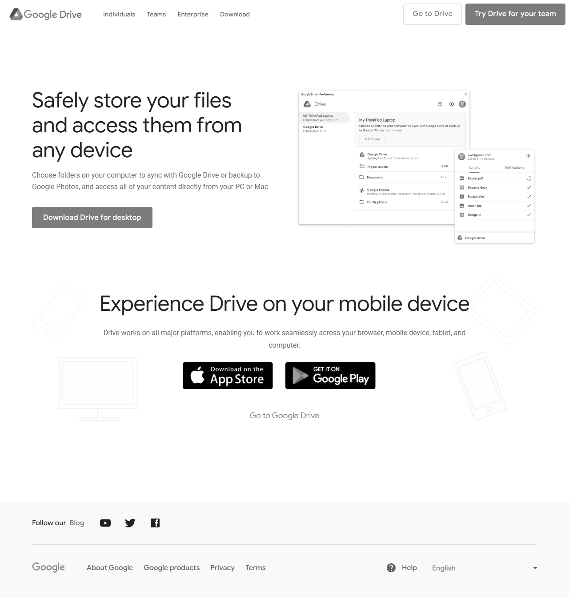

# WebSiteChangesTracker
Provides a console app to track changes at websites view<br/>
#### Can be used to: 
* Monitor changes that are not entirely under your control
* Find differences after big changes at your site like refactoring or migrating to another libs
#### Known bugs: 
* It works pretty randomly with JS sliders with timed auto swiping and iframes - sometimes it can find differences even if there is none of them

## Input
To get all available commands type "help" into command line args
## Output


## Configurating
Configure app and add your website settings.<br/>
To see all available project settings check the [Project configuration](https://github.com/daug32/WebSiteChangesTracker/blob/main/WebSiteComparer.Core/Configurations/WebsiteConfiguration.cs).<br/>
To see all available website settings check the [Website configuration model](https://github.com/daug32/WebSiteChangesTracker/blob/main/WebSiteComparer.Core/Configurations/WebsiteConfiguration.cs).<br/>

```json
{
  "WebSiteComparerConfiguration": {
    "ScreenshotDirectory": "C:\\Users\\user\\Downloads\\WebsiteChangesTracker\\Screenshots",
    "ChangesTrackingOutputDirectory": "C:\\Users\\user\\Downloads\\WebsiteChangesTracker\\Difference"
  },
  "WebSites": [
    {
      "Urls": [
        "https://some.domain.com/",
        "https://some.domain.com/en",
        "https://some.domain.com/de",
        "https://some.domain.com/it"
      ],
      "ScreenshotWidth": 1280,
      "PageLoadingConfiguration": {
        "DisableJavaScript": false
      }
    }
  ]
}
```